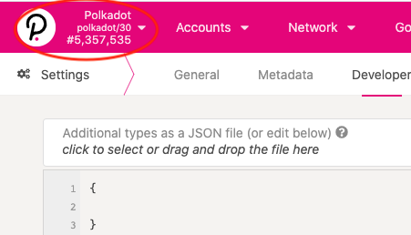
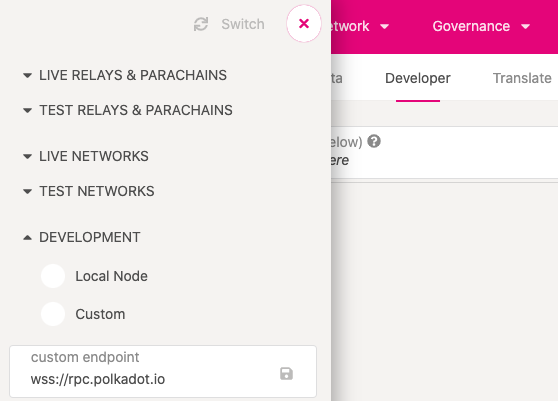

<!-- MarkdownTOC autolink="true" -->

- [Substrate Knowledge Map for Hackathon Participants](#substrate-knowledge-map-for-hackathon-participants)
  - [Overview](#overview)
    - [Why Substrate? \(Substrate Blockchain Runtime vs Smart Contract\)](#why-substrate-substrate-blockchain-runtime-vs-smart-contract)
    - [Navigating Our Documentations](#navigating-our-documentations)
  - [Basics](#basics)
    - [Setup Your Local Development Environment](#setup-your-local-development-environment)
    - [Interact with a Substrate Network using Polkadot-JS Apps](#interact-with-a-substrate-network-using-polkadot-js-apps)
  - [Preliminaries](#preliminaries)
    - [Rust](#rust)
    - [How Blockchain Works](#how-blockchain-works)
  - [Substrate Runtime Development](#substrate-runtime-development)
    - [High Level Architecture](#high-level-architecture)
    - [Runtime Development Topics](#runtime-development-topics)
  - [Polkadot JS API](#polkadot-js-api)
  - [Smart Contract](#smart-contract)
    - [Using **ink!**](#using-ink)
  - [What We Do Not Cover](#what-we-do-not-cover)
  - [Terms Clarification](#terms-clarification)

<!-- /MarkdownTOC -->

# Substrate Knowledge Map for Hackathon Participants

The following is an overview of knowledge map what a hackathon participant need to know in order to
develop a non-trivial application for hackathon submission. There is a high level description on
each domain and point to the corresponding documentation so you can dig deeper in that subject.
Tutorials will be introduced in the middle to serve as a good break from reading and actually get
your hand dirty and consolidate what you have learned.

## Overview

### Why Substrate? (Substrate Blockchain Runtime vs Smart Contract)

One question we often get is why learning Substrate framework when we can write smart contracts.

Substrate framework and writing smart contracts are two different approaches to building
"decentralized applications".

Traditional smart contract platform allows users to publish additional logic on top of some core
blockchain logic. Since smart contract logic can be published by anyone, including malicious actors
and inexperienced developers, there are a number of intentional safe guards and restriction built
around these public smart contract platform. For example:

- **Fees**: Ensuring that contract users are charged for the computation and storage they force on
  the computers running their contract, and not allowed to abuse the block creators.

- **Sandboxed**: A contract is not able to modify core blockchain storage or the storage of other
  contracts directly. It's power is limited to only modifying it's own state, and the ability to
  make outside calls to other contracts or runtime functions.

- **Reversion**: A contract can be prone to have situations which lead to logical errors. You will
  need additional pattern such as splitting logic and data so you can upgrade your smart contract
  logic seamlessly.

These different overheads makes running contracts slower and more costly, but again, the "target
audience" for contract development is different than runtime developers.

But contracts allows your community to extend and develop on top of your runtime logic without
needing to go through all the craziness of proposals, runtime upgrades, etc... It may even be used
as a testing grounds for future runtime changes, but done in a way that isolates your network from
any of the growing pains or errors which may occur.

In summary, smart contracts:

- Are inherently safer to the network.
- Have built in economic incentives and transaction fee mechanism built-in not under direct
  control of smart contract author.
- Have computational overhead to support graceful failures in logic.
- Have a lower bar to entry for development, and enable faster pace of community interaction.

---

On the other hand, Substrate runtime development afford none of these protections or safe guards. As
a runtime developer, you have total control on how the blockchain behave, but the bar to entry on
the code you produce also jumps way up.

You have full control of the underlying logic that each node on your network will run. You have full
access to each and every storage item across all of your modules, which you can modify and control.

We also have a mechanism of allowing the Substrate runtime (a.k.a. state transition function, or
STF) to be upgraded with a single transaction instead of having to organize a community hard-fork.
This is one of the prominent features when Substrate is being developed.

In summary, runtime development:

- Provide low level access to your entire blockchain.
- Have removed the overhead of built-in safety for performance.
- Have a high bar to entry for developers.

> For more detail, refer to
> [**Smart Contract - Overview**](https://substrate.dev/docs/en/knowledgebase/smart-contracts/overview)
> and the
> [Polkadot Builders Guide](https://wiki.polkadot.network/docs/build-build-with-polkadot#what-is-the-difference-between-building-a-parachain-a-parathread-or-a-smart-contract)
> Content on the above partially came from this resources.

### Navigating Our Documentations

We have a few documentation sites. One key in learning Substrate is knowing how to navigate through
these sites and find the information you need. Sometimes the objective is to learn more about a
certain concept, other times it is to look for code to perform certain tasks.

[**Substrate Developer Hub**](https://substrate.dev/), this site has the most comprehensive
all-round coverage about Substrate, from big picture architecture explanation to various technical
concepts. It also contains series of tutorials covering a wide breadth of topics, and finally the
API docs. This should be the first go-to place if you want to look up a certain aspect during
Substrate runtime development. The site is consisted of:

- [Knowledge Base](https://substrate.dev/docs/en/): Explaning the foundational concepts of
  building blockchain runtime using Substrate.

- [Tutorials](https://substrate.dev/en/tutorials): Hand-on tutorials for developers to follow.
  **The first SIX tutorials are showing the fundamentals in Substrate and are recommended for
  every Substrate learner to go through.**

- [How-to Guides](https://substrate.dev/substrate-how-to-guides/) /
  [Recipes](https://substrate.dev/recipes): It is like the O'Reilly cookbook series written in a
  task-oriented way for readers to get the job done, e.g. setting up proper weight functions for
  extrinsics, using off-chain workers to fetch HTTP requests, etc. It can also be read from
  cover-to-cover for developers to learn advanced Substrate development techniques. We are slowly
  migrating content over from Recipes to How-to Guides.

- [API docs](https://substrate.dev/rustdocs): Substrate API references.

We also feature a light weight Substrate node
[Substrate Node Template](https://github.com/substrate-developer-hub/substrate-node-template), the
minimal Substrate blockchain node, and
[Substrate Front-end template](https://github.com/substrate-developer-hub/substrate-front-end-template),
a front-end built with React using [Polkadot-JS API](https://polkadot.js.org/docs/api/) to connect
to Substrate. Developers are encouraged to start new Substrate project based on these templates.

If you face that technical questions and need support, feel free to join the
[Substrate Technical matrix channel](https://app.element.io/#/room/!HzySYSaIhtyWrwiwEV:matrix.org).

[**Polkadot Wiki**](https://wiki.polkadot.network/), this site documents the specific behavior and
mechanism of Polkadot network, which is built using Substrate framework. Having said that, Polkadot
has a lot of customization/specialization built on top of Substrate, in particular, acting as a
relayer for multiple blockchains to connect in, and allow them to have cross-blockchain message
passing. If you want to know more how that is done, please check the wiki.

[**Polkadot JS API doc**](https://polkadot.js.org/docs/api/), documents on how to use Polkadot-JS
API, a set of javascript API allowing developers having their dApps or frontend connect to
Substrate-based blockchains to query and send transactions over.

👉 **Complete [Quiz #1](quizzes/01-overview.md)**

## Basics

### Setup Your Local Development Environment

Here You will setup your local machine to install Rust compiler and have both stable and nightly
version of the compiler installed. This is because currently Substrate runtime is compiled to native
binary using the stable Rust compiler, and then to WASM binary, which only nightly Rust compiler
could do this.

Also refer to:

- [Setup Substrate in unix-based machines](https://substrate.dev/docs/en/knowledgebase/getting-started/)
- [Setup Substrate in Windows](https://substrate.dev/docs/en/knowledgebase/getting-started/windows-users)

👉 **Complete [Lab #1: Run a Substrate Node](labs/01-run-a-substrate-node.md)**

### Interact with a Substrate Network using Polkadot-JS Apps

[Polkadot JS Apps](http://polkadot.js.org/apps) is the canonical front-end to interact with
Substrate-based chains and wallets to manage your Substrate user accounts.

Polkadot-JS Apps can be used to connect to any remote Substrate-based chain, not just the default
Polkadot mainnet. You can config the endpoint where Apps connected to, even to your `localhost`
running node. Refer to the following two diagrams.

1. Click on the top left side showing your currently connected network:

2. Scroll to the bottom of the menu, open **DEVELOPMENT**, and choose either **Local Node** or
   **Custom** to specify your own endpoint.

👉 **Complete [Lab #2: Using Polkadot-JS Apps](labs/02-polkadot-js-interaction.md)**

> **Notes**: If you are connecting Apps to a custom chain (or your locally-running node), you may
> need to specify the chain custom data type in JSON under **Settings** > **Developer**.
>
> Polkadot-JS Apps only receive a series of bytes from the blockchain. It is up to the developer to
> tell the Apps how to decode and interpret these custom data type. Refer to:
>
> - [Polkadot JS doc: Type basics](https://polkadot.js.org/docs/api/start/types.basics)
> - [Polkadot JS doc: Extending types](https://polkadot.js.org/docs/api/start/types.extend)

You will also need to create an account. Here contains
[detail steps on account generation](https://wiki.polkadot.network/docs/en/learn-account-generation).
You could create an account using [Polkadot-JS Browser Plugin](https://polkadot.js.org/extension/),
a metamask-like browser extension to manage your Substrate accounts, and it will automatically
imported into Polkadot-JS Apps.

> **Notes**: when you run a Substrate chain in development mode (with `--dev` flag), well-known
> accounts of `Alice`, `Bob`, `Charlie`, etc are always created for you.

👉 **Complete [Lab #3: Create an Account](labs/03-create-account.md)**

👉 **Complete [Quiz #2](quizzes/02-basics.md)**

## Preliminaries

You need to know Rust programming language and have a good understanding on how blockchain work in
order to understanding what's going on developing with Substrate. The following are resources to
brush up on these areas.

### Rust

You will need to know Rust to understand what's going on in Substrate and to program in Substrate
framework.

If you are new to Rust, or need a brush up on your Rust knowledge, please refer to
[The Rust Book](https://doc.rust-lang.org/book/). You could still continue on learning about
Substrate framework, but when in doubt about what the syntax means, come back to this section to
look them up. Especially on:

- ch 1 - 10: These chapters cover the foundational knowledge of programming in Rust
- ch 13: On iterators and closures
- ch 18 - 19: On advanced traits, advanced types. Learn a bit about macro as well. You will not
  necessarily writing your own macro, but will be using a lot of Substrate built-in macro to write
  your blockchain runtime.

👉 **Complete [Quiz #3](quizzes/03-rust.md)**

### How Blockchain Works

As you are writing a blockchain runtime, you will need to know what a blockchain is, and how it
works. If not, here are a series of video explaining how blockchain work in general:
[**Web3 Blockchain Fundamental MOOC Youtube videos**](https://www.youtube.com/playlist?list=PLxVihxZC42nF_MCN9PTvZMIifRjx9cZ2J).

The key lectures would be lectures 1 - 7 and lecture 10. That's 8 lectures, or about 4 hours of
video.

## Substrate Runtime Development

### High Level Architecture

To know more about the high level architecture of Substrate. Please go through the documents on
**[Getting Started: Overview](https://substrate.dev/docs/en/)** and
**[Getting Started: Architecture](https://substrate.dev/docs/en/knowledgebase/getting-started/architecture)**.

In this document, we assume you will develop Substrate runtime with
[FRAME](https://substrate.dev/docs/en/knowledgebase/runtime/frame) (v2). This is what a Substrate
node consists of.

Each node has many components that manage things like the transaction queue, communicating over a
P2P network, reaching consensus on the state of the blockchain, and the chain's actual runtime logic
(aka the blockchain runtime). Each aspect of the node is interesting in its own right, and the
runtime is particularly interesting because it contains the business logic (aka "state transition
function") that codifies the chain's functionality. The runtime contains a collection of pallets
that are configured to work together.

On the node level, we leverage on [libp2p](https://libp2p.io/) for the p2p networking layer. We also
put the transaction pool, consensus mechanism, and underlying data storage (a key-value database) on
the node level. These components all work "under the hood", and in this knowledge map we will not
cover them much except just mentioning their existence.

👉 **Complete [Quiz #4](quizzes/04-architecture.md)**

### Runtime Development Topics

In [Substrate Developer Hub](https://substrate.dev/), we have a thorough coverage on various
subjects you need to know to develop with Substrate. So here we just list out the key topics and
reference back to Developer Hub. Please go through the following key concepts and the directed
resources to know the fundamentals of runtime development.

- [**Key Concept: Runtime**](https://substrate.dev/docs/en/knowledgebase/runtime/), this is where
  the blockchain state transition function (the blockchain application-specific logic) is defined.
  It is about composing multiple pallets (can be understood as modules) together in the runtime
  and hooking them up together.

- [**Runtime Development: Execution**](https://substrate.dev/docs/en/knowledgebase/runtime/execution),
  this page describe how a block is being produced, and how transactions are selected and executed
  to reach the next "stage" in the blockchain.

- [**Runtime Develpment: Pallets**](https://substrate.dev/docs/en/knowledgebase/runtime/pallets),
  this doc describe what the basic structure of a Substrate pallet is consisted of.

- [**Runtime Development: FRAME**](https://substrate.dev/docs/en/knowledgebase/runtime/frame),
  this doc gives a high level overview on what system pallets that Substrate has already
  implemented for you as runtime engineer. Have a quick skim so you have a basic idea of what
  pallets Substrate consists.

👉 **Complete [Lab #4: Tutorial of Adding a Pallet into Runtime](labs/04-tutorial-add-a-pallet.md)**

- [**Runtime Development: Storage**](https://substrate.dev/docs/en/knowledgebase/runtime/storage),
  this doc describes how data is stored on-chain and how you could access them.

- [**Runtime Development: Events**](https://substrate.dev/docs/en/knowledgebase/runtime/events) &
  [**Errors**](https://substrate.dev/docs/en/knowledgebase/runtime/errors), these two pages
  describe how external parties know what has happened in the blockchain, via the emitted events
  and errors when executing transactions.

> **Notes**: All of the above concepts we leverage on `#[pallet::*]` macro to define them in the
> code. If you are interested to learn more about what other types of pallet macros have been
> defined, goto [its API doc](https://substrate.dev/rustdocs/latest/frame_support/attr.pallet.html)
> and
> [this doc on some frequently used Substrate macros](https://substrate.dev/docs/en/knowledgebase/runtime/macros).

👉 **Complete [Lab #5: Tutorial of building a Proof-of-Existence dApp](labs/05-poe.md)**.

- [Writing Tests for Your Pallet](https://substrate.dev/docs/en/knowledgebase/runtime/tests):
  learn to build up a mock runtime and write test cases for your pallet logics.

👉 **Complete
[Lab #6: Tutorial of building a Substrate Kitties dApp](labs/06-substrate-kitties.md)**.

👉 **Complete [Quiz #5](quizzes/05-runtime-development.md)**

## Polkadot JS API

[Polkadot JS API](https://polkadot.js.org/docs/api/) is the javascript API for Substrate. So you can
build a javascript front end or utility and interact with Substrate-based blockchain.

[Substrate Front-end Template](https://github.com/substrate-developer-hub/substrate-front-end-template)
is an example of using Polkadot JS API in your React front-end (a
[hosted version here](https://substrate.dev/substrate-front-end-template/)).

- [Runtime Development: Metadata](https://substrate.dev/docs/en/knowledgebase/runtime/metadata),
  this doc describes the API opened from the chain allowing external parties query what API is
  open for the chain. Polkadot JS API makes use of this chain metadata to know what queries and
  functions are available from the chain to calls.

👉 **Complete [Lab #7: Using Polkadot-JS API](labs/07-polkadot-js-api.md)**.

👉 **Complete [Quiz #6: Using Polkadot-JS API](quizzes/06-polkadot-js-api.md)**.

## Smart Contract

Learn about the difference between smart contract development vs Substrate runtime development, and
when to use each [here](https://substrate.dev/docs/en/knowledgebase/smart-contracts).

In Substrate, you can program smart contract in ink!.

### Using **ink!**

- Learn about
  [smart contract development in Substrate](https://substrate.dev/docs/en/knowledgebase/smart-contracts/)
- Learn about
  [Smart contract development using ink!](https://substrate.dev/docs/en/knowledgebase/smart-contracts/contracts-pallet)

👉 **Complete [Quiz #7: Using ink!](quizzes/07-using-ink!.md)**.

## What We Do Not Cover

A lot 😄

- On-chain runtime upgrade. We have a tutorial on
  [On-chain(forkless) Runtime Upgrade](https://substrate.dev/docs/en/tutorials/forkless-upgrade/).
  This tutorial introduces how to perform runtime upgrade and scheduled runtime upgrade as a chain
  transaction.

- About [transaction weight](https://substrate.dev/docs/en/knowledgebase/learn-substrate/weight),
  [fee](https://substrate.dev/docs/en/knowledgebase/runtime/fees), and
  [benchmarking your runtime to determine the proper transaction cost](https://substrate.dev/docs/en/knowledgebase/runtime/benchmarking).

- [Off-chain Features](https://substrate.dev/docs/en/knowledgebase/learn-substrate/off-chain-features)

  There are certain limits on on-chain logic. They include that the computation cannot be too
  intensive that it affect the block output time, and the computation must be deterministic. This
  means that computation rely on external data fetching cannot be done on-chain. In Substrate,
  developers can also run computation off-chain and have the result send back on-chain via
  extrinsics. The following articles cover them.

  - [Recipes: Submit signed and unsigned transactions from off-chain workers back on-chain](https://substrate.dev/recipes/off-chain-workers/transactions.html)
  - [Recipes: Fetch external data using HTTP requests and parse JSON responses](https://substrate.dev/recipes/off-chain-workers/http-json.html)
  - [Recipes: Store result in off-chain worker local storage](https://substrate.dev/recipes/off-chain-workers/storage.html)

- [Tightly- and Loosely-coupled pallets](https://substrate.dev/recipes/pallet-coupling.html),
  calling other pallet functions from one pallet via trait specification.

- [Blockchain Consensus Mechansim](https://wiki.polkadot.network/docs/en/learn-consensus), and a
  recipe on customizing it to proof-of-work [here](https://substrate.dev/recipes/basic-pow.html).

- [Parachains](https://wiki.polkadot.network/docs/en/learn-parachains): one key feature of
  Polkadot is the capability of becoming a parachain. You can develop your own
  application-specific logic in your chain and rely on the validator community of the relay-chain
  to secure your network, instead of building another validator community yourself. Learn more
  about:

  - [Cross-chain Message Passing (XCMP)](https://wiki.polkadot.network/docs/en/learn-crosschain),
    how parachain and relay-chain communicate to each others
  - [Workshop: Using cumulus to build your parachain](https://substrate.dev/cumulus-workshop)

## Terms Clarification

- **Substrate**: the blockchain development framework built for writing highly customized
  blockchain
- **Polkadot**: Polkadot is the mainnet that built using Substrate
- **Kusama**: Kusama is another network similar with Polkadot that served as the canary to launch
  new features before these features are launched in Polkadot. You could view it as a beta-net
  except that it is also a value-bearing network and the state on the blockchain network will not
  be reset.
- **Web 3.0**: is the decentralized internet ecosystem that, instead of the app are centrally
  stored in a few servers and managed by a sovereign party, it is an open, trustless, and
  permissionless networks.
- **Web3 Foundation**: A foundation setup to support development of decentralized web software
  protocols. See more in [the website](https://web3.foundation/about/).
